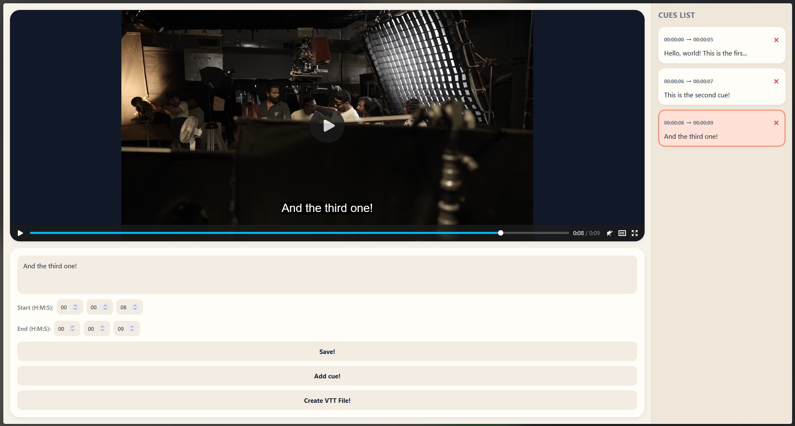
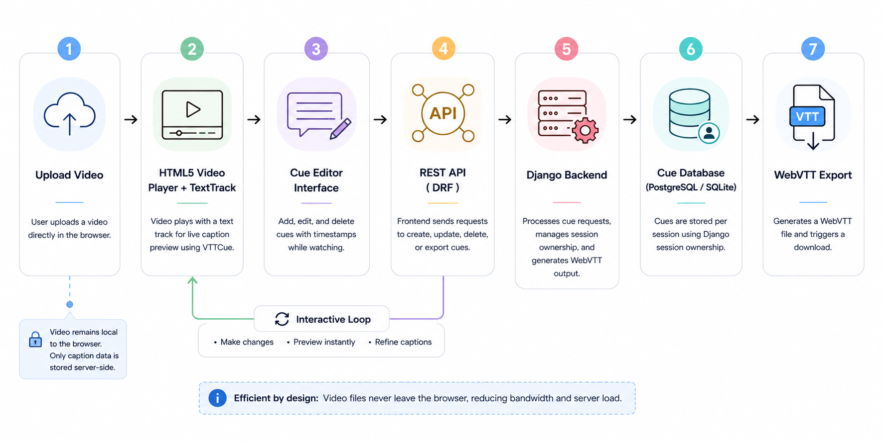

# Video Caption Editor

> A full-stack web application for creating, editing, and exporting WebVTT caption files directly in the browser — built with Django REST Framework and vanilla JavaScript.

---

**Key Features:** In-browser video playback · Visual cue card management · Real-time WebVTT track preview · One-click VTT file export · Session-based multi-user support · RESTful API backend

## 🚀 Live Demo & Visuals

- **Application Link:** _(Add your deployment URL here)_

### App Preview

|        Upload Screen         |         Editor View          |
| :--------------------------: | :--------------------------: |
|  |  |

### System Architecture



---

## 📑 Overview & Core Capabilities

Manually writing WebVTT caption files is tedious, error-prone, and disconnected from the actual video content. This project provides an integrated captioning workspace where users can upload a video, create timestamped cues while watching, and export a standards-compliant `.vtt` file — all without leaving the browser.

### System Capabilities

- **Drag-and-Drop Video Upload:** Accepts any browser-supported video format via file input or drag-and-drop.
- **Visual Cue Timeline:** Cues are rendered as native HTML5 `VTTCue` objects on the video's text track, providing immediate visual feedback.
- **Time Input Flexibility:** Manually enter start/end times in hours, minutes, and seconds, or auto-generate 5-second cues from the current playback position.
- **Cue Card Sidebar:** All cues are displayed as interactive cards with inline delete functionality and single-click selection for editing.
- **Session-Based Isolation:** Each browser session receives its own set of cues via Django's session framework — no user authentication required.
- **One-Click Export:** Generates a properly formatted WebVTT file and triggers an immediate browser download.

---

## 🛠️ Technology Stack

| Layer                      | Technologies & Libraries Used                |
| :------------------------- | :------------------------------------------- |
| **Frontend UI**            | Vanilla JavaScript (ES Modules), HTML5, CSS3 |
| **Frontend Notifications** | Toastify.js                                  |
| **Backend API**            | Django REST Framework                        |
| **Database**               | PostgreSQL (with Django ORM)                 |
| **Session Management**     | Django Sessions                              |
| **Serialization**          | Django REST Framework Serializers            |

---

## 🏗️ System Architecture & Data Flow

### The Data Pipeline

```text
User Uploads Video
       ↓
HTML5 Video Element + TextTrack
       ↓
User Creates/Edits Cues via UI
       ↓
REST API Calls (POST/PATCH/DELETE)
       ↓
Django Views → Serializer Validation
       ↓
PostgreSQL Database (TemporaryTrack Model)
       ↓
WebVTT File Generation (GET /api/format_file/)
       ↓
Browser Download
```

### Database Schema Design

Each cue is stored as a row in the `TemporaryTrack` table, scoped to an anonymous session.

#### `TemporaryTrack` Table

| Field           | Type            | Description                                                  |
| --------------- | --------------- | ------------------------------------------------------------ |
| `id`            | `AutoField`     | Primary key identifier.                                      |
| `text`          | `CharField`     | Caption text content (max 300 characters).                   |
| `start_time`    | `CharField`     | Human-readable start timestamp (e.g., `00:01:23`).           |
| `end_time`      | `CharField`     | Human-readable end timestamp.                                |
| `start_seconds` | `FloatField`    | Start time in seconds, used for sorting and VTTCue creation. |
| `end_seconds`   | `FloatField`    | End time in seconds.                                         |
| `author_id`     | `CharField`     | Django session key — isolates cues per browser session.      |
| `last_active`   | `DateTimeField` | Auto-updated timestamp of last modification.                 |

**Indexes:** An index on `author_id` ensures fast retrieval of session-scoped cues.

**Ordering:** Cues are sorted by `start_seconds`, then by `id`, guaranteeing deterministic display order.

---

## 🔌 API Endpoints

| Method   | Endpoint                | Description                                      |
| -------- | ----------------------- | ------------------------------------------------ |
| `GET`    | `/`                     | Serves the editor interface with existing cues.  |
| `POST`   | `/api/add_cue/`         | Creates a new blank cue from current video time. |
| `PATCH`  | `/api/save_cue/<id>/`   | Updates an existing cue's text and timestamps.   |
| `DELETE` | `/api/delete_cue/<id>/` | Removes a cue from the database.                 |
| `GET`    | `/api/format_file/`     | Generates and returns a WebVTT-formatted file.   |

### WebVTT Export Format

The `format_file` endpoint constructs a standards-compliant WebVTT file:

```text
WEBVTT

1
00:00:05.000 --> 00:00:10.000
Hello, this is the first caption.

2
00:00:12.500 --> 00:00:18.200
And this is another one.
```

Timestamps follow the `HH:MM:SS.mmm` format with zero-padded hours and minutes.

---

## 📂 Project Structure

```text
video-caption-editor/
├── assets/
│   ├── architecture.png        # System architecture diagram
│   ├── upload.png              # Upload screen screenshot
│   └── editor.png              # Editor view screenshot
│
├── captions_generator/         # Django project package (settings, root URL config, WSGI)
│
├── generator/                  # Main Django app
│   ├── templates/
│   │   └── generator/
│   │       └── generator.html  # Main editor template
│   ├── static/
│   │   └── generator/
│   │       ├── css/
│   │       │   └── generator.css
│   │       └── js/
│   │           └── generator.js # Frontend application logic
│   ├── views.py                # View functions and API endpoints
│   ├── models.py               # TemporaryTrack database model
│   ├── serializers.py          # DRF serializer
│   └── urls.py                 # App URL routing
│
├── .gitignore                  # Git ignore rules
├── LICENSE                     # MIT license
├── README.md                   # Project documentation
├── build.sh                    # Deployment build script
├── manage.py                   # Django management script
└── requirements.txt            # Python dependencies
```

---

## ⚙️ Installation & Setup

Follow these steps to clone the project, configure dependencies, and run the development server locally.

```bash
git clone https://github.com/jzb-01/captions-generator.git
cd video-caption-editor

python -m venv venv

# Linux/macOS
source venv/bin/activate

# Windows
venv\Scripts\activate

pip install -r requirements.txt

python manage.py migrate
python manage.py runserver
```

Once running, open your web browser and navigate to: `http://127.0.0.1:8000/`

---

## 💡 Technical Challenges

- **Session-Based Data Isolation Without Authentication:** Implementing anonymous cue ownership using Django's session framework. Each browser session receives a unique `session_key` used as the `author_id`, allowing multiple simultaneous users without accounts or login flows.
- **Frontend-Backend State Synchronization:** Keeping the JavaScript `cuesRecord` array, the DOM card sidebar, the HTML5 `VTTCue` text track, and the server-side database all in sync required careful orchestration across async fetch calls — particularly during rapid cue creation and deletion.
- **WebVTT Timestamp Formatting:** Converting between user-friendly `HH:MM:SS` input fields and the `HH:MM:SS.mmm` format required by the WebVTT specification, including proper zero-padding, float precision handling, and video duration boundary validation.
- **Optimistic UI Updates with Error Recovery:** The frontend optimistically updates local state before awaiting server confirmation. If the API call fails, the error is surfaced via Toastify notifications without corrupting the database or requiring a full page reload.
- **CSRF Protection in AJAX Calls:** All mutating fetch requests require Django's CSRF token, extracted from browser cookies and attached as a custom header — a common pain point in Django + vanilla JS stacks.

---

## 🧠 What I Learned

Through designing and developing this project, I gained practical, hands-on experience in:

- **Full-Stack Django Development:** Building RESTful API endpoints with Django REST Framework, including serializers, partial updates (PATCH), and session-scoped querysets.
- **Vanilla JavaScript Application Architecture:** Structuring a non-framework frontend with event delegation, DOM manipulation, module scripts, and async/await API communication patterns.
- **HTML5 Video API Integration:** Programmatically managing `VTTCue` objects on `TextTrack` elements, controlling track visibility modes, and synchronizing playback position with editor state.
- **WebVTT Specification Compliance:** Generating standards-compliant caption files with proper header formatting, cue numbering, and millisecond-precision timestamps.
- **CSRF Security Patterns:** Handling cross-site request forgery protection in single-page applications using cookie extraction and custom request headers.
- **UI State Management:** Maintaining consistent visual states across loading, disabled, error, and success conditions using CSS class toggling and toast notifications.

---

## 📌 Potential Enhancements

- **Caption Styling Support:** Extend the editor to accept inline WebVTT styling tags (`<b>`, `<i>`, `<u>`, `<c>`) for rich-text captions.
- **Keyboard Shortcuts:** Add hotkeys for common actions (e.g., `Ctrl+S` to save, `Ctrl+N` to add a new cue, arrow keys for frame-by-frame seeking).
- **Bulk Import:** Allow users to upload existing `.vtt` or `.srt` files and populate the editor automatically.
- **Timeline Visualization:** Replace the cue card sidebar with an interactive timeline bar showing cue placement relative to the full video duration.
- **Draft Auto-Save:** Periodically persist unsaved changes to localStorage or the server to prevent data loss on accidental tab closure.
- **Video Trimming Tools:** Add controls to preview a specific cue's time window in a loop for precise caption timing adjustments.

---

## 📄 License & Author

- **License:** Distributed under the MIT License. See `LICENSE` for details.
- **Author:** Jordan Zarate
- **Repository:** https://github.com/jzb-01/captions-generator.git
